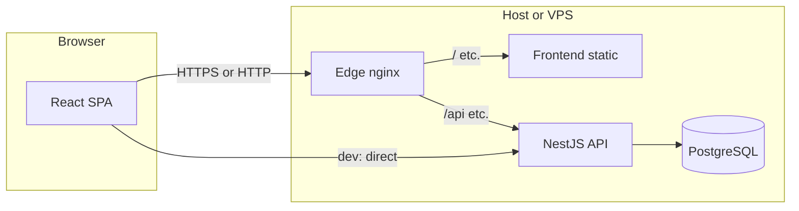

# Goal Tracker — Architecture

This document describes how the **Goal Tracker** application is structured, which technologies it uses, and how **Docker** fits into local development and production-style deployment.

## System overview

The product is a **monorepo** with two deployable parts and one data store:

| Layer | Role |
|--------|------|
| **Frontend** | Single-page app (SPA); talks to the API over HTTP. |
| **Backend** | REST API, validation, persistence, health checks. |
| **PostgreSQL** | Primary database for users, goals, and goal entries. |

In **local development**, PostgreSQL usually runs in Docker while the API and UI run on the host with hot reload. In **full Docker** (production compose), Postgres, API, static frontend, and an edge **nginx** reverse proxy run as containers on a shared bridge network. TLS and routing rules live under the repo **`nginx/`** directory and are bind-mounted into the edge container (see `docker-compose.prod.yml`).



## Tech stack

### Backend (`backend/`)

- **Runtime**: Node.js 18 (see Dockerfiles).
- **Framework**: [NestJS](https://nestjs.com/) 11 (`@nestjs/core`, `@nestjs/common`, `@nestjs/platform-express`).
- **Configuration**: `@nestjs/config` with environment variables.
- **Database**: PostgreSQL via `pg` and **TypeORM** (`@nestjs/typeorm`, `typeorm`).
- **API shape**: REST; DTO validation with `class-validator` / `class-transformer`.
- **Observability / ops**: `@nestjs/terminus` for health; global validation pipe and exception filter in `main.ts`.
- **Migrations**: TypeORM migrations (`migration:*` scripts in `package.json`); in production, `migrationsRun` is enabled when `NODE_ENV === 'production'` (see `app.module.ts`).
- **Testing**: Jest, `ts-jest`, `@nestjs/testing`, `supertest`, `jest-mock-extended`.

### Frontend (`frontend/`)

- **UI**: React 19, React DOM 19.
- **Build / dev**: Vite 7, `@vitejs/plugin-react`.
- **Language**: TypeScript (~5.9).
- **Styling**: Tailwind CSS 4 with `@tailwindcss/postcss`, PostCSS, Autoprefixer.
- **Linting**: ESLint 9 with TypeScript ESLint and React hooks / refresh plugins.

### Infrastructure and tooling

- **Package manager**: **pnpm** (lockfiles under `backend/` and `frontend/`).
- **Containers**: Docker multi-stage builds; **Docker Compose** v3.8 manifests at repo and `backend/` roots.
- **Production edge**: `nginx:alpine` in `docker-compose.prod.yml` terminates HTTP/HTTPS on the host and proxies to the `frontend` and `backend` services using config from **`nginx/`**.
- **Deployment helper**: `deploy.sh` wraps `docker compose` for a VPS-style workflow.

## Repository layout (high level)

```
goal-tracker-v2/
├── backend/                 # NestJS API
│   ├── src/                 # App, modules, entities, migrations, database seeding
│   ├── docker-compose.yml   # PostgreSQL only (local dev DB)
│   ├── Dockerfile           # API image (build + production stage)
│   └── package.json
├── frontend/                # React + Vite SPA
│   ├── Dockerfile           # Vite build + nginx:alpine serving static files
│   ├── nginx.conf           # Server block inside the frontend image (not the edge proxy)
│   └── package.json
├── nginx/                   # Edge reverse proxy (bind-mounted in prod compose)
│   ├── nginx.conf           # Main context; includes conf.d/*.conf
│   ├── conf.d/              # Virtual hosts, /api → backend, / → frontend, /health, etc.
│   ├── ssl/                 # TLS material (e.g. cert.pem / key.pem); not committed
│   └── generate-ssl-cert.sh # Optional self-signed cert helper (run from repo root)
├── docker-compose.prod.yml  # Postgres + backend + frontend + edge nginx
├── deploy.sh                # start/stop/logs/update/status/backup for prod compose
└── docs/
    └── ARCHITECTURE.md      # This file
```

### Edge reverse proxy (`nginx/`)

`docker-compose.prod.yml` mounts this folder into the **nginx** service:

| Host path | Container path | Purpose |
|-----------|----------------|---------|
| `./nginx/nginx.conf` | `/etc/nginx/nginx.conf` | Global nginx settings; includes `conf.d/*.conf` |
| `./nginx/conf.d` | `/etc/nginx/conf.d` | Site definitions (e.g. `default.conf`): upstreams to `backend:3005` and `frontend:80`, `/api` prefix handling, `/health` to the API |
| `./nginx/ssl` | `/etc/nginx/ssl` | Certificate and private key for HTTPS (paths referenced in `conf.d` — often `cert.pem` / `key.pem`) |

The **`nginx/ssl/`** directory is listed in `.gitignore`; create it on the server with real certs (for example Let's Encrypt) or generate self-signed files for testing using **`nginx/generate-ssl-cert.sh`** from the repository root (it writes under `nginx/ssl/`).

## How to use Docker

### 1. PostgreSQL only (typical local development)

**File**: `backend/docker-compose.yml`

- Service: **postgres** (`postgres:16-alpine`).
- **Host port**: `5434` → container `5432` (avoids clashing with a local Postgres on 5432).
- **Persistence**: named volume `postgres_data`.
- **Network**: `goal-tracker-network`; container name **`goal-tracker-v2`** (as defined in that file).

**Prerequisites**: A `.env` file in `backend/` (copy from `.env.example`) with `DATABASE_USER`, `DATABASE_PASSWORD`, and `DATABASE_NAME` — these are passed into the Postgres container.

**Commands** (from `backend/`):

```bash
pnpm run docker:up      # docker-compose up -d
pnpm run docker:logs    # logs -f postgres
pnpm run docker:down    # docker-compose down
pnpm run docker:clean   # down -v (removes volume / data)
pnpm run docker:restart
```

Or directly:

```bash
cd backend
docker compose up -d
docker compose ps
docker compose logs -f postgres
```

Point the Nest app at `DATABASE_HOST=localhost` and `DATABASE_PORT=5434` (as in `backend/.env.example`).

### 2. Full stack (production-style compose)

**File**: `docker-compose.prod.yml` (run from **repository root**)

Services:

| Service | Image / build | Notes |
|---------|----------------|--------|
| **postgres** | `postgres:16-alpine` | Same port mapping idea: host `5434` → `5432`. Container name `goal-tracker-postgres`. |
| **backend** | Build `backend/Dockerfile` | `DATABASE_HOST=postgres`, internal port `5432`. Listens on `3005`. Health: `GET /health`. |
| **frontend** | Build `frontend/Dockerfile` | Build arg `VITE_API_BASE_URL` baked into the SPA (default `http://localhost/api` if unset). Serves the built SPA with nginx inside the image (not the same as edge nginx). |
| **nginx** | `nginx:alpine` | Publishes `HTTP_PORT` / `HTTPS_PORT` (defaults **80** / **443**). Depends on `frontend` and `backend`. Uses read-only mounts from **`nginx/`** (see table above). |

**Environment**: Use a root-level **`.env.production`** (see `backend/env.production.example` for the variable set: DB credentials, `CORS_ORIGINS`, `VITE_API_BASE_URL`, `HTTP_PORT`, `HTTPS_PORT`, etc.). `deploy.sh` loads this file and passes it to Compose.

**Helper script** (from repo root):

```bash
./deploy.sh start    # up -d --build
./deploy.sh stop
./deploy.sh restart
./deploy.sh logs
./deploy.sh update   # git pull + rebuild
./deploy.sh status
./deploy.sh backup   # pg_dump via goal-tracker-postgres
```

**Direct Compose** (equivalent idea):

```bash
docker compose -f docker-compose.prod.yml --env-file .env.production up -d --build
docker compose -f docker-compose.prod.yml --env-file .env.production ps
```

### 3. What each Dockerfile does

- **`backend/Dockerfile`**: Node 18 Alpine → pnpm install → build Nest → production stage with prod dependencies only; **`CMD`** runs `node dist/src/main.js`; exposes **3005**.
- **`frontend/Dockerfile`**: Node 18 Alpine builder with `VITE_API_BASE_URL` → Vite build → copy `dist` into **`nginx:alpine`** with `frontend/nginx.conf` as the server config inside that image; exposes **80** to other containers only (host traffic goes through edge nginx in prod compose).

### 4. Networking and ports (cheat sheet)

| Context | Postgres (host) | API | Frontend | Edge nginx |
|---------|-----------------|-----|----------|------------|
| Local dev (DB in Docker) | `localhost:5434` | `localhost:3005` | Vite dev server `5173` | N/A |
| `docker-compose.prod.yml` | Host `5434` | Internal `backend:3005` | Internal `frontend:80` | Host `HTTP_PORT` / `HTTPS_PORT` (defaults 80 / 443) |

On the Compose network, containers reach each other using **service names** in `docker-compose.prod.yml` (e.g. `postgres`, `backend`, `frontend`, `nginx`).

## Configuration highlights

- **CORS**: Driven by `CORS_ORIGINS` (comma-separated). If unset, the API allows flexible origins (see `main.ts`).
- **Schema**: Development may use TypeORM `synchronize` when not in production; production relies on **migrations** with `migrationsRun: true`.
- **Health**: Backend exposes a health endpoint used by Docker healthchecks in both the backend image and `docker-compose.prod.yml`.

## Related reading

- Root **`README.md`**: step-by-step local setup, API endpoints, schema summary, and troubleshooting.
- **`backend/env.production.example`**: template for production env vars used with `docker-compose.prod.yml` / `deploy.sh`.
- **`docs/HTTPS_SETUP.md`**: HTTPS and certificate setup.
